# Openarmx与Isacc sim联动

# 一、安装isaacsim

## 1\.下载所需要的文件

https://docs\.isaacsim\.omniverse\.nvidia\.com/5\.0\.0/installation/download\.html

进入链接中下载如下所示文件

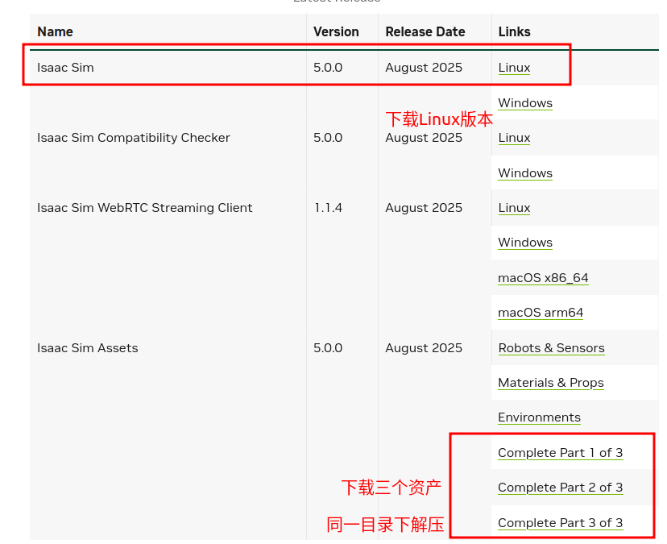

下载Isaacsim本身的压缩包。

## 2\.解压文件

在主目录（home）新建新建文件夹isaac\_sim。

将下载好的压缩包，解压放入到文件夹isaac\_sim中。


进入isaacsim文件夹，打开终端后输入：

```Plain Text
cd ~/isaac_sim
./isaac-sim.selector.sh
```

看到如下界面则表示下载成功

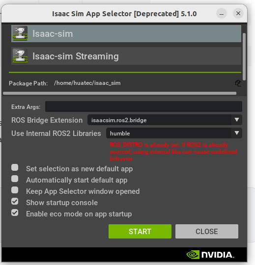

# 二、ROS2启动Isaac Sim

NVIDIA官方提供了ROS包，https://github\.com/isaac\-sim/IsaacSim

目前包放入openarmx\_ws中，需要修改以下两个目录。

`文件openarmx_ws/src/isaacsim/scripts/run_isaacsim.py`

修改第一步装的isaacsim的文件夹目录。

```Plain Text
"isaac_sim_path": "/home/huatec/isaac_sim",
```

gui为isaacsim启动时的usd文件路径。

`文件openarmx_ws/src/isaacsim/launch/run_isaacsim.launch.py`

```Plain Text
DeclareLaunchArgument('gui', default_value='/home/huatec/openarmx_ws/openarmx_isaac_urdf/openarmx_isaac.usd', description='Provide the path to a usd file to open it when starting Isaac Sim in standard gui mode. If left empty, Isaac Sim will open an empty stage in standard gui mode.'),
```

# 三、Isaac Lab安装

https://blog\.csdn\.net/m0\_65805744/article/details/150344985

# 四、action graph（ROS通讯）

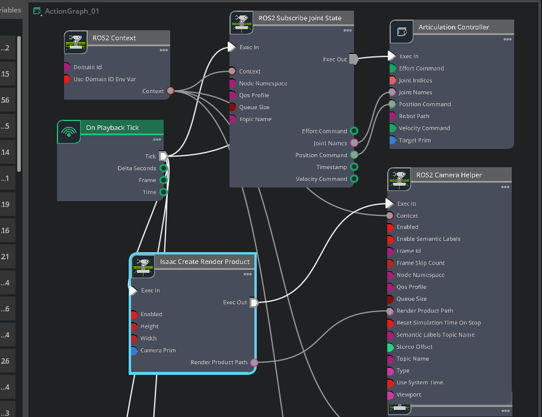

注：如果搜不到topic消息，需要查看ROS的domain id是否正确，本项目为66。

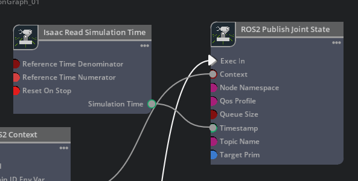

如果发布订阅有问题，需要对opeanrmx的根节点进行处理（重置根节点，使isaacsim识别到机器人的各关节）：

选中root\_joint,删除其中的Articulation Root。

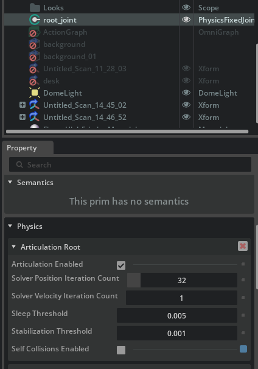

右键openarmx，依次点击add，Physics，Articulation Root。

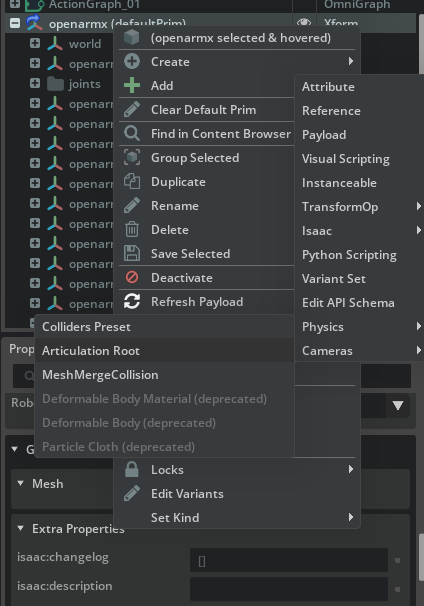

更改完之后，需要关掉self collision enabled，否则机器人会自己碰撞，发生抖动。


# 五、Isaac Sim中使用lerobot录制数据集

## 终端 1：启动 Isaac Sim

```Plain Text
cd ~/openarmx_ws 
source install/setup.bash

ros2 launch isaacsim run_isaacsim.launch.py
```

## 终端 2：启动 OpenArmX 双臂控制（现在默认为抬手姿态）

```Plain Text
cd ~/openarmx_ws
source install/setup.bash

ros2 launch isaacsim openarmx_command_to_joint_state.launch.py 
```

## 终端 3：启动 PICO VR 手柄

```Plain Text
cd ~/openarmx_ws
source install/setup.bash

ros2 launch openarmx_teleop_vr_pico teleop_vr_pico.launch.py
```

## 终端 4：启动 VR 到 OpenArmX 桥接节点

```Plain Text
cd ~/openarmx_ws
source install/setup.bash

ros2 run openarmx_teleop_bridge_vr_pico openarmx_teleop_bridge_vr_pico_node
```

## 终端 5：启动 LeRobot 录数据

```Plain Text
lerobot-env
HF_HUB_OFFLINE=1 lerobot-record \
      --robot.type=openarmx_follower_ros2 \
      --teleop.type=openarmx_leader_ros2 \
      --dataset.repo_id=local/openarmx_dataset \
      --dataset.single_task="palce the green cube on the box" \
      --dataset.num_episodes=50 \
      --dataset.episode_time_s=9999 \
      --dataset.reset_time_s=15 \
      --dataset.push_to_hub=false \
      --display_data=true \
      --dataset.vcodec=h264
      # 编码器名称['h264', 'hevc', 'libsvtav1']
```

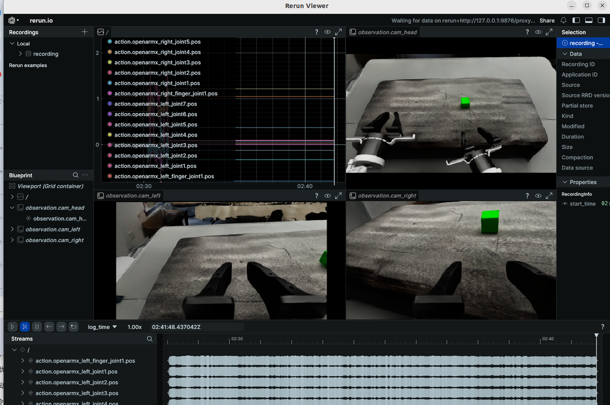

export ISAACSIM\_PATH="$\{HOME\}/isaac\_sim"

export ISAACSIM\_PYTHON\_EXE="$\{ISAACSIM\_PATH\}/python\.sh"

# 六、Isaac Lab中使用lerobot录制数据集

## 启动 Isaac Lab

```Plain Text
cd ~/isaac_lab
conda activate env_isaaclab

./isaaclab.sh -p my_env/demo.py 

```

# 七、重力补偿实体对仿真同构遥操

## **7\.1先生成 urdf 文件**

执行指令：

```Plain Text
cd ~/opeanrmx_ws
xacro ./src/openarmx_description/urdf/robot/v10.urdf.xacro  arm_type:=v10 bimanual:=true > /tmp/v10_bimanual.urdf
```

## **7\.2启动双臂**

```Bash
source ~/openarmx_ws/install/setup.bash
ros2 launch openarmx_teleop_bimanual teleop_bimanual_with_gravitycomp.launch.py
```

# 八、Isaac常见问题

## 8\.1点击 Extensions 崩溃或aciton graph消失

问题现象：启动 Isaac Sim 时日志报错：

```Plain Text
omni.kit.converter.hoops failed to load
```

后续点击：

```Plain Text
Window -> Extensions
```

会直接崩溃。

日志里真正关键报错是：

```Plain Text
ModuleNotFoundError: No module named 'psutil'
```

说明 **Isaac Sim 自带 Python 环境缺少 ****`psutil`**** 包**。

Extensions 窗口在扫描扩展时，会加载部分扩展测试模块，这些模块依赖 `psutil`，缺少该库后导致 Extensions 界面崩溃。

解决方法用 Isaac Sim 自带的 `python.sh` 安装：

```Plain Text
cd ~/isaac_sim
./python.sh -m pip install --upgrade pip
./python.sh -m pip install psutil
```

验证是否安装成功：

```Plain Text
./python.sh -c "import psutil; print(psutil.__version__)"
```

能正常输出版本号即可。

## 8\.2 如何关闭线框显示

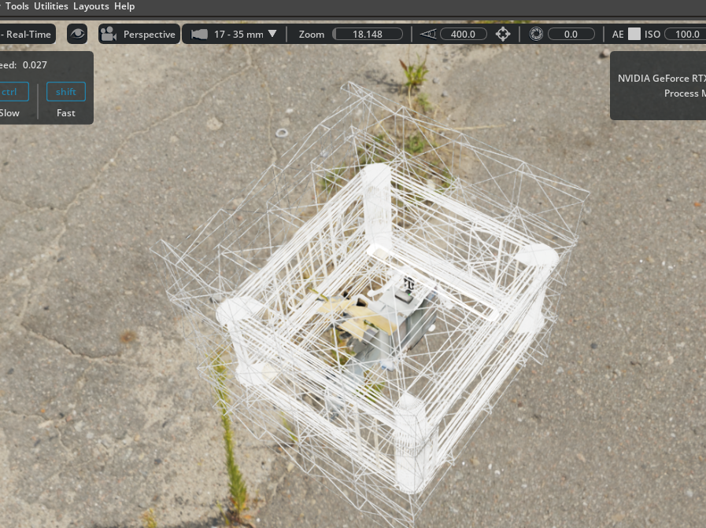

左上角菜单里这一项：

```Plain Text
Wireframe    快捷键Shift + W
```

## 8\.3夹爪碰撞体积修改

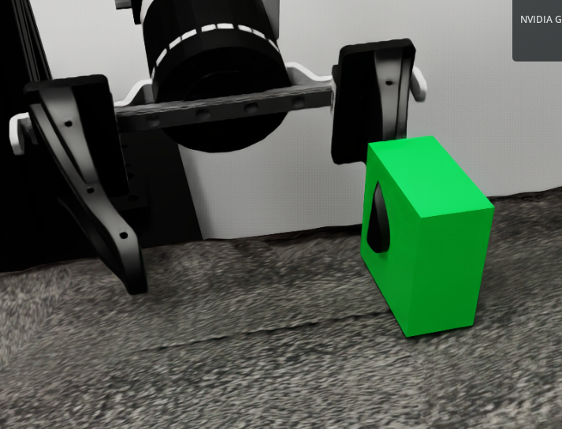

左边有蓝色标记，说明现在开启了线框显示，所以所有物体都变成白色线框/透明效果。

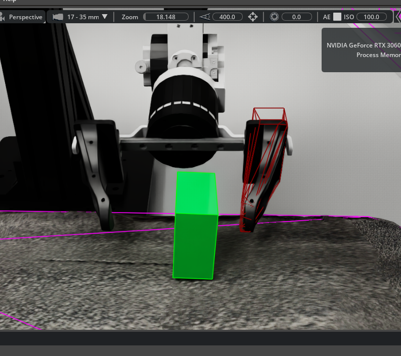

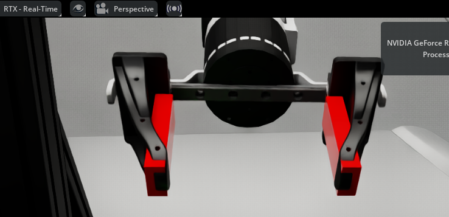


## 8\.4摩擦力绑定

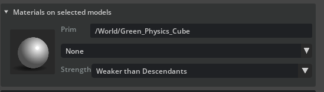

## 8\.5 输出力矩

机械臂抖动现象：

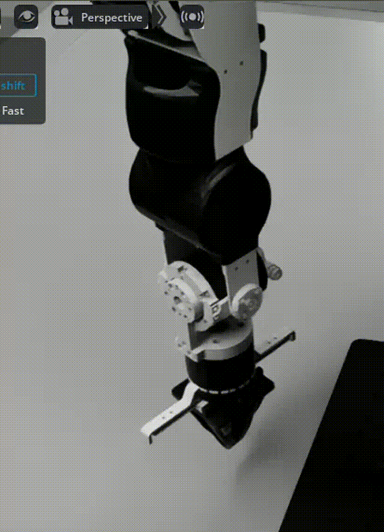

在 Isaac Sim 这个 Joint Drive 里，基本就是用类似 PD 的方式让关节追踪目标位置和目标速度：

```Plain Text
输出力矩 ≈ Kp（Stiffness） × 位置误差 + Kd × 速度误差（Damping）
```

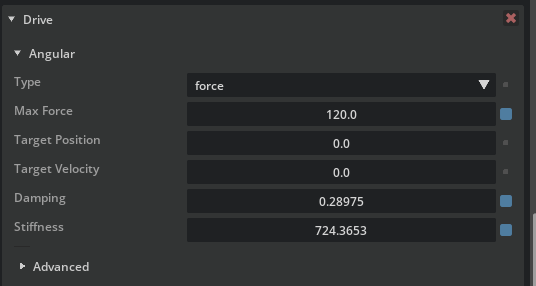

设定完Max force、Damping、stiffness之后，可以看见抓起来物体，但是存在一些穿模问题。

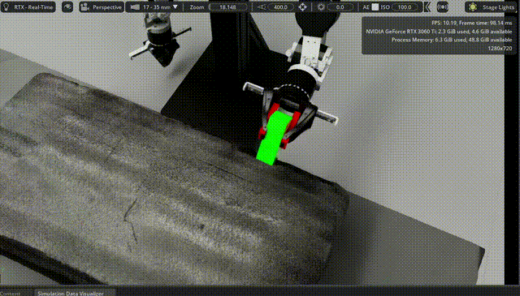

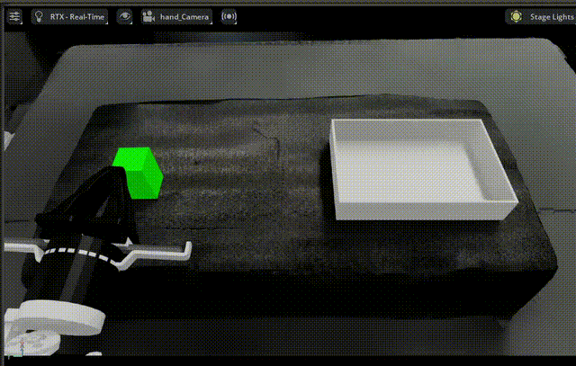


# 九、Isaac Lab Mimic数据合成

https://isaac\-sim\.github\.io/IsaacLab/main/source/overview/imitation\-learning/teleop\_imitation\.html

## 9\.1 数据采集

```Plain Text
cd ~/isaac_lab
conda activate env_isaaclab
./isaaclab.sh -p my_env/record_demo.py --passive --episodes 10
```

## 9\.2 数据合成

原理：基于少量人工示教轨迹自动扩增高质量任务数据。

首先通过人工遥操作采集若干条成功的抓取放置轨迹，并保存为 HDF5 格式；随后对原始轨迹进行子任务标注，将完整任务划分为接近物体、下降抓取、夹爪闭合、抬升、移动到目标位置和释放物体等阶段。数据生成阶段，Mimic 根据随机化后的物体位姿，对原始示教中的末端执行器轨迹进行空间变换，并通过插值方式拼接不同子任务片段，形成新的候选轨迹。候选轨迹会在 Isaac Lab 仿真环境中重新执行，并根据任务成功判据筛选，只有成功完成抓取放置任务的 episode 才会被写入最终数据集。最终生成的 HDF5 数据再转换为 LeRobotDataset 格式，用于 SmolVLA 策略训练。

```Bash
cd ~/isaac_lab
conda activate env_isaaclab
# 第 1 步：重新标注（过滤不完整 episode）
./isaaclab.sh -p my_env/annotate_demos.py \
    --input ./datasets/cube_tray_source.hdf5 \
    --output ./datasets/cube_tray_annotated.hdf5

# 第 2 步：重新运行数据生成
cd ~/isaac_lab
conda activate env_isaaclab
./isaaclab.sh -p my_env/generate_mimic_dataset.py \
    --input_file ./datasets/cube_tray_annotated.hdf5 \
    --output_file ./datasets/cube_tray_generated.hdf5 \
    --generation_num_trials 200 \
    --enable_cameras
 
```

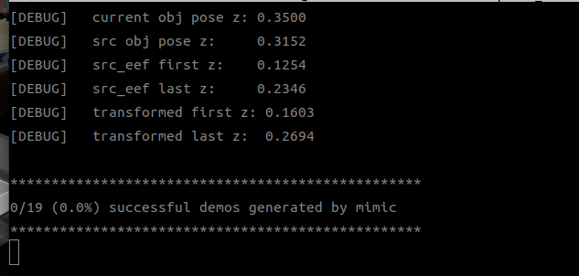


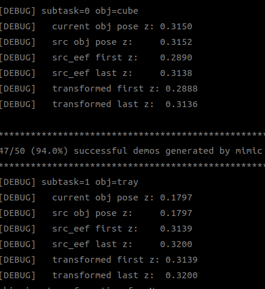

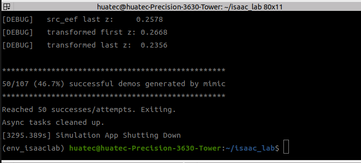

数据生成完之后，对hdf5格式转换成lerbotdataset格式。

```Plain Text
cd ~/isaac_lab
python3 /home/huatec/isaac_lab/my_env/convert_to_lerobot.py
```

## 9\.3 数据查看（lerbot格式）

```Plain Text
lerobot-env
HF_HUB_OFFLINE=1 lerobot-dataset-viz \
  --repo-id local/openarmx_dataset \
  --root /home/huatec/isaac_lab/datasets/cube_tray_lerobot_more_random \
  --mode local \
  --episode-index 0 \
  --display-compressed-images false
```

## 9\.4 训练（smolvla）×

```Plain Text
export http_proxy=http://127.0.0.1:7890
export https_proxy=http://127.0.0.1:7890
export all_proxy=socks5://127.0.0.1:7890

lerobot-env
lerobot-train \
  --dataset.repo_id=local/openarmx_dataset \
  --dataset.root=/home/huatec/isaac_lab/datasets/cube_tray_lerobot \
  --dataset.video_backend=pyav \
  --policy.type=smolvla \
  --policy.pretrained_path=/home/huatec/models/smolvla_base \
  --policy.vlm_model_name=/home/huatec/models/SmolVLM2-500M-Video-Instruct \
  --policy.push_to_hub=false \
  --batch_size=16 \
  --steps=30000 \
  --output_dir=/home/huatec/isaac_lab/smolvla_output_fit_unfreeze \
  --wandb.enable=true \
  --log_freq=50 \
  --save_freq=5000
```


```Plain Text
lerobot-env
lerobot-train \
  --dataset.repo_id=local/openarmx_dataset \
  --dataset.root=/home/huatec/isaac_lab/datasets/cube_tray_lerobot \
  --dataset.video_backend=pyav \
  --dataset.image_transforms.enable=true \
  --policy.type=smolvla \
  --policy.pretrained_path=/home/huatec/models/smolvla_base \
  --policy.vlm_model_name=/home/huatec/models/SmolVLM2-500M-Video-Instruct \
  --policy.push_to_hub=false \
  --batch_size=1 \
  --steps=30000 \
  --output_dir=/home/huatec/isaac_lab/smolvla_output_fit_unfreeze \
  --wandb.enable=true \
  --policy.train_expert_only=false \
  --policy.freeze_vision_encoder=false \
  --log_freq=50 \
  --save_freq=5000

```


断点训练：

```Plain Text
lerobot-env

lerobot-train \
  --config_path=/home/huatec/isaac_lab/smolvla_output_fit/checkpoints/030000/pretrained_model/train_config.json \
  --resume=true \
  --steps=60000 \
  --output_dir=/home/huatec/isaac_lab/smolvla_output_fit \
  --wandb.enable=true \
  --log_freq=50 \
  --save_freq=5000
```


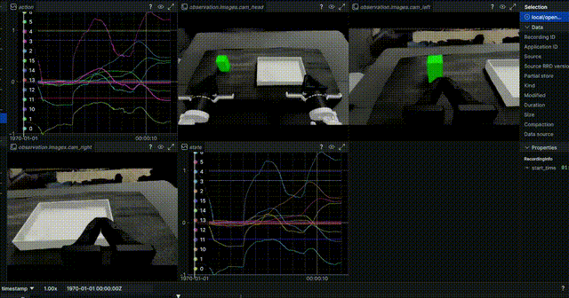

## 9\.5 推理

```Plain Text
lerobot-env

HF_HUB_OFFLINE=1 lerobot-record \
  --robot.type=openarmx_follower_ros2 \
  --robot.skip_send_action=false \
  --dataset.repo_id=local/eval_smolvla_openarmx_output \
  --dataset.single_task="place the green cube on the box" \
  --dataset.num_episodes=100 \
  --dataset.episode_time_s=999 \
  --dataset.reset_time_s=10 \
  --dataset.push_to_hub=false \
  --display_data=true \
  --policy.type=smolvla \
  --policy.pretrained_path="/home/huatec/isaac_lab/smolvla_output_fit/checkpoints/050000/pretrained_model" \
  --policy.device=cuda

```

没对夹爪进行平滑处理，导致模型学习到夹爪一直开关闭合。

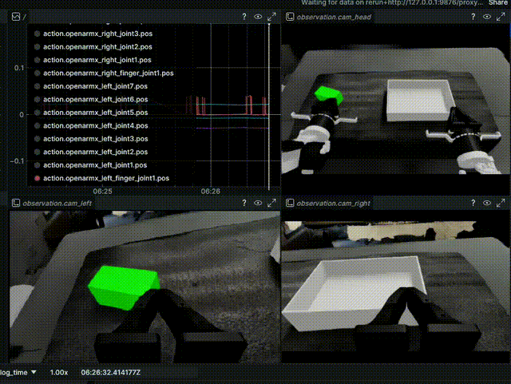

对夹爪的action进行平滑处理之后，夹爪明显不再反复开关。

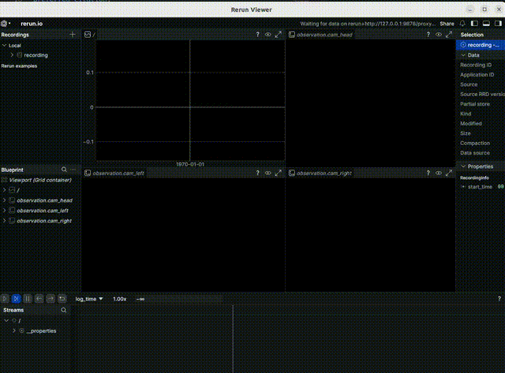

在宿主机执行：

```Plain Text
docker run --name isaac-lab --entrypoint bash -it --gpus all --runtime=nvidia --ipc=host \
  -e "ACCEPT_EULA=Y" \
  --rm \
  --network=host \
  -e "PRIVACY_CONSENT=Y" \
  -v ~/docker/isaac-sim/cache/kit:/isaac-sim/kit/cache:rw \
  -v ~/docker/isaac-sim/cache/ov:/root/.cache/ov:rw \
  -v ~/docker/isaac-sim/cache/pip:/root/.cache/pip:rw \
  -v ~/docker/isaac-sim/cache/glcache:/root/.cache/nvidia/GLCache:rw \
  -v ~/docker/isaac-sim/cache/computecache:/root/.nv/ComputeCache:rw \
  -v ~/docker/isaac-sim/logs:/root/.nvidia-omniverse/logs:rw \
  -v ~/docker/isaac-sim/data:/root/.local/share/ov/data:rw \
  -v ~/docker/isaac-sim/documents:/root/Documents:rw \
  -v ~/isaac_projects:/workspace/isaac_projects:rw \
  nvcr.io/nvidia/isaac-lab:2.3.2
```

重点就是这一行：

```Plain Text
-v ~/isaac_projects:/workspace/isaac_projects:rw
```

它的意思是：

```Plain Text
宿主机：
/home/huatecserver/isaac_projects

容器里：
/workspace/isaac_projects
```


```Plain Text
cd /workspace/isaaclab

./isaaclab.sh -p /workspace/isaac_projects/isaac_lab/my_env/demo.py --livestream 2
```

## 9\.6 训练（xvla）√

```Plain Text
export http_proxy=http://127.0.0.1:7897
export https_proxy=http://127.0.0.1:7897
export all_proxy=socks5://127.0.0.1:7897

lerobot-train \
  --dataset.repo_id=local/cube_tray_lerobot_random \
  --dataset.root=/home/huatecserver/isaac_projects/isaac_lab/datasets/merged_dataset_v2 \
  --dataset.video_backend=pyav \
  --job_name=xvla_openarmx_bimanual_random \
  --policy.path=/home/huatecserver/models/xvla-base \
  --policy.dtype=bfloat16 \
  --policy.action_mode=auto \
  --policy.max_action_dim=20 \
  --policy.device=cuda \
  --policy.freeze_vision_encoder=false \
  --policy.freeze_language_encoder=false \
  --policy.train_policy_transformer=true \
  --policy.train_soft_prompts=true \
  --policy.push_to_hub=false \
  --policy.empty_cameras=0 \
  --policy.num_image_views=3 \
  --rename_map='{"observation.images.cam_head": "observation.images.image", "observation.images.cam_right": "observation.images.image2", "observation.images.cam_left": "observation.images.image3"}' \
  --output_dir=/home/huatecserver/isaac_projects/isaac_lab/outputs/xvla_openarmx_sim_real_merge \
  --batch_size=8 \
  --steps=80000 \
  --wandb.enable=true \
  --log_freq=100 \
  --save_freq=20000
```

## 9\.7 推理

训练完之后需要更改配置文件，

`/home/huatec/isaac_lab/outputs_random/pretrained_model/config.json`

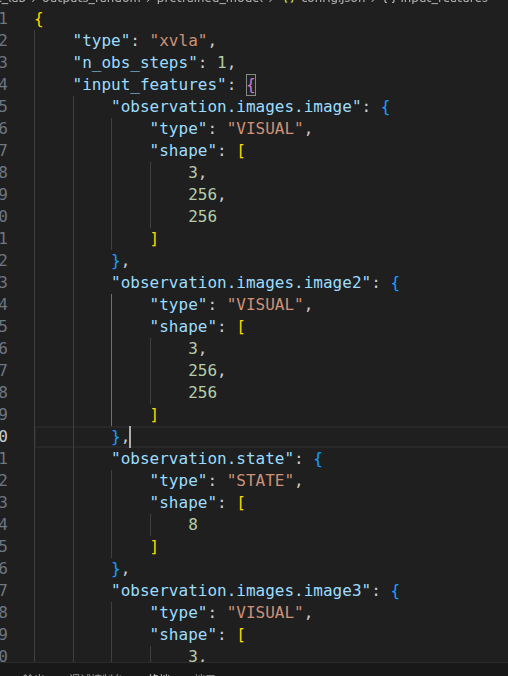

将image，image2，image3，依次改为cam\_head，cam\_right，cam\_left。

如下图所示。

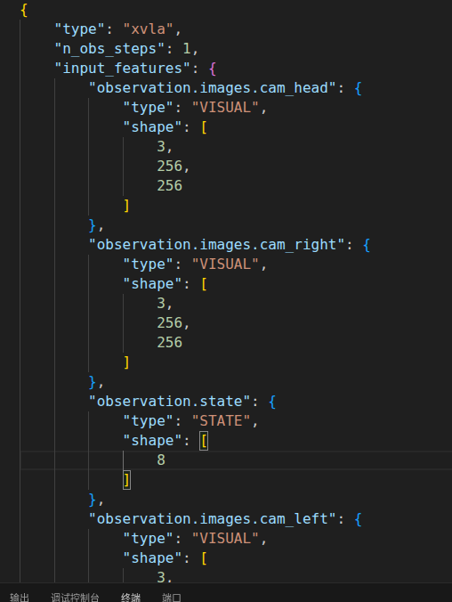

需要开启三个终端。

```Plain Text
cd ~/isaac_lab
conda activate env_isaaclab

./isaaclab.sh -p my_env/demo.py 
```

```Plain Text
cd ~/openarmx_ws
source install/setup.bash

ros2 launch isaacsim openarmx_command_to_joint_state.launch.py 
```

```Plain Text
export http_proxy=http://127.0.0.1:7890
export https_proxy=http://127.0.0.1:7890
export all_proxy=socks5://127.0.0.1:7890

lerobot-env

lerobot-record \
  --robot.type=openarmx_follower_ros2 \
  --robot.skip_send_action=false \
  --dataset.repo_id=local/eval_xvla_openarmx_output \
  --dataset.single_task="place the green cube on the box" \
  --dataset.num_episodes=100 \
  --dataset.episode_time_s=999 \
  --dataset.reset_time_s=10 \
  --dataset.push_to_hub=false \
  --policy.path=/home/huatec/isaac_lab/outputs_sim_to_real_more_random/checkpoints/015000/pretrained_model \
  --policy.device=cuda \
  --display_data=true

```

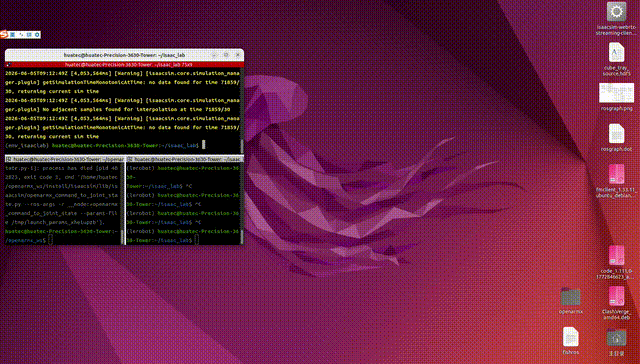


## 9\.8 sim to real

200条的仿真数据作为第一阶段预训练80k，10条真机数据进行第二阶段训练20k。

```Plain Text
rsync -avP \
/home/huatecserver/isaac_projects/isaac_lab/outputs/xvla_openarmx_sim_to_real_more_range/checkpoints \
huatec@192.168.3.5:/home/huatec/isaac_lab/outputs_sim_to_real_more_random
```

```Plain Text
export http_proxy=http://127.0.0.1:7897
export https_proxy=http://127.0.0.1:7897
export all_proxy=socks5://127.0.0.1:7897

lerobot-train \
  --dataset.repo_id=local/cube_tray_lerobot_random \
  --dataset.root=/home/huatecserver/isaac_projects/isaac_lab/datasets/openarmx_dataset_sim_to_real \
  --dataset.video_backend=pyav \
  --job_name=xvla_openarmx_sim_to_real \
  --policy.path=/home/huatecserver/isaac_projects/isaac_lab/outputs/xvla_openarmx_sim_more_random/checkpoints/080000/pretrained_model \
  --policy.dtype=bfloat16 \
  --policy.action_mode=auto \
  --policy.max_action_dim=20 \
  --policy.device=cuda \
  --policy.freeze_vision_encoder=false \
  --policy.freeze_language_encoder=false \
  --policy.train_policy_transformer=true \
  --policy.train_soft_prompts=true \
  --policy.push_to_hub=false \
  --policy.empty_cameras=0 \
  --policy.num_image_views=3 \
  --rename_map='{"observation.images.cam_head": "observation.images.image", "observation.images.cam_right": "observation.images.image2", "observation.images.cam_left": "observation.images.image3"}' \
  --output_dir=/home/huatecserver/isaac_projects/isaac_lab/outputs/xvla_openarmx_sim_to_real_more_range \
  --batch_size=8 \
  --steps=20000 \
  --wandb.enable=true \
  --log_freq=100 \
  --save_freq=5000

```

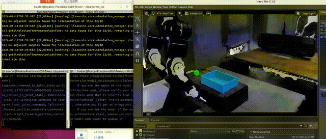


